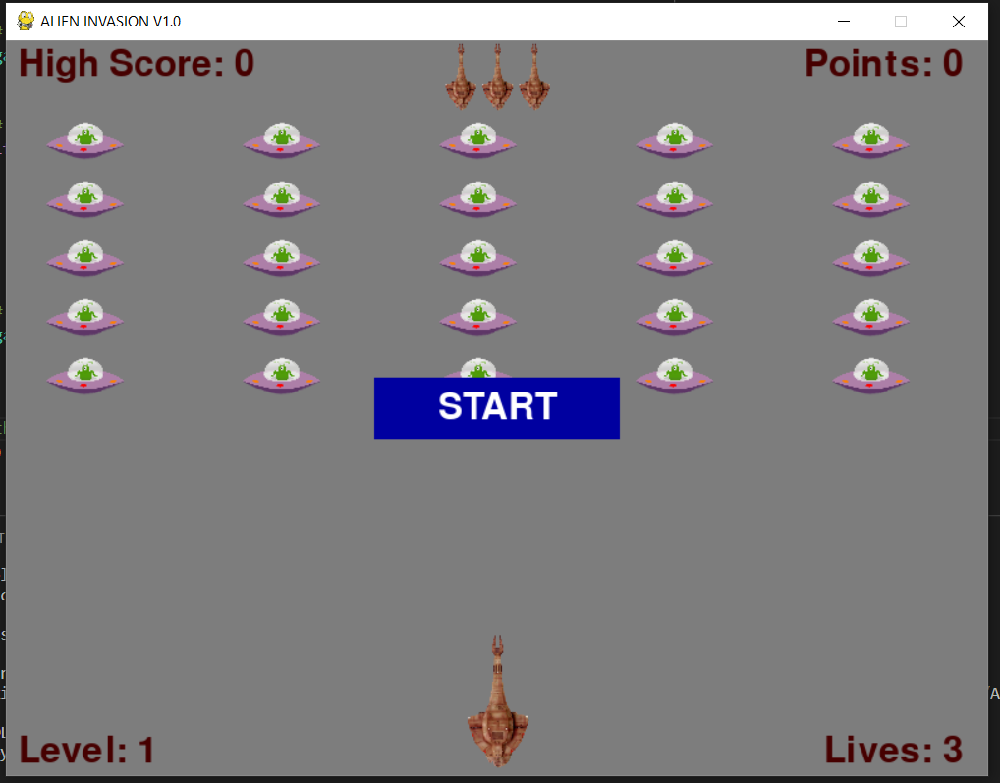
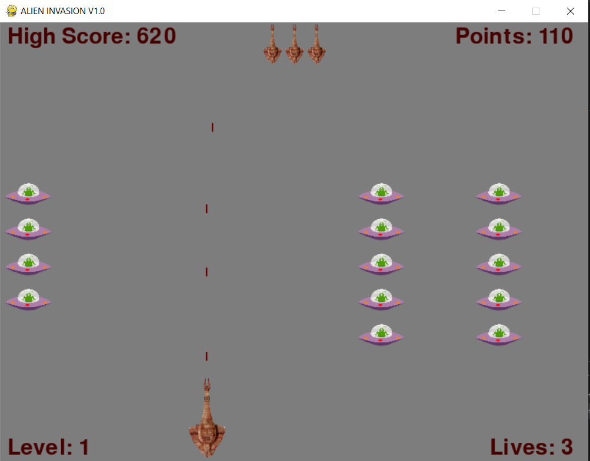
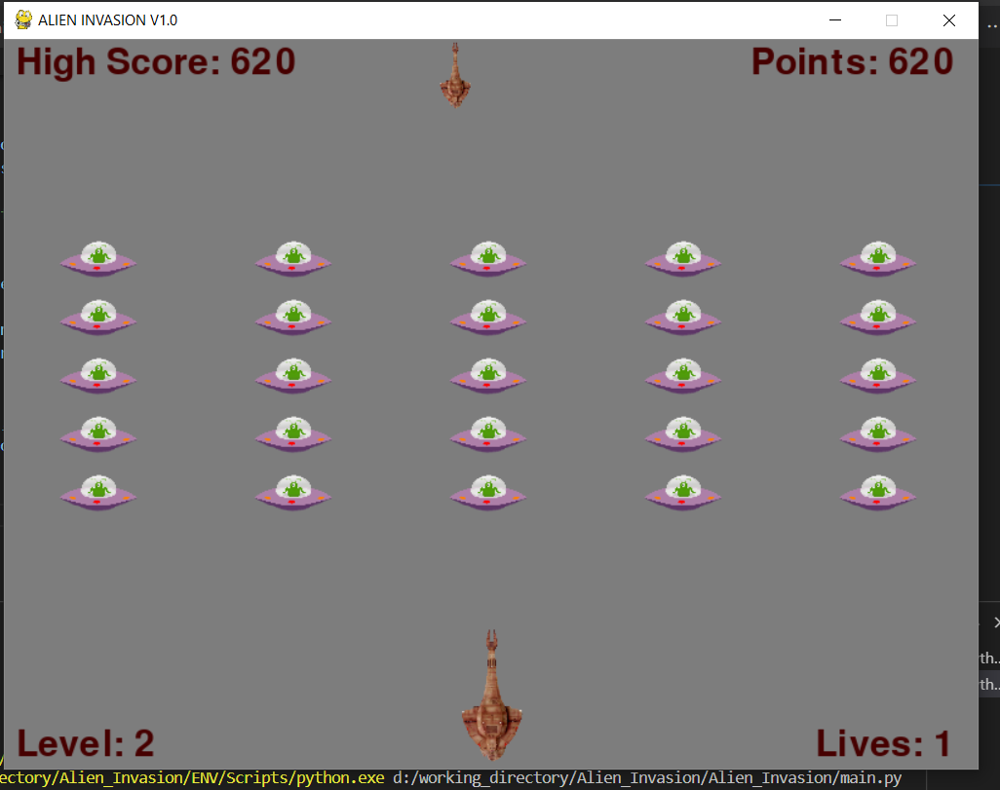

# Alien_Invasion
Alien Invasion is a simple 2D video game in which the player fights aliens that 
are dropping.

Game was developed using Python 3.10.4 , Pygame package, and a virtual 
environment. Everything is included in the repository. 

To run the game you have to run the main.py file

Folder "images" includes all the pictures drawn in the game.
Folder "data" includes a json files that is used for storing the highest score 
of the player

The file "requirements.txt" includes all the python packages that need to be 
installed to run this game

**Game View**

 

 

 
